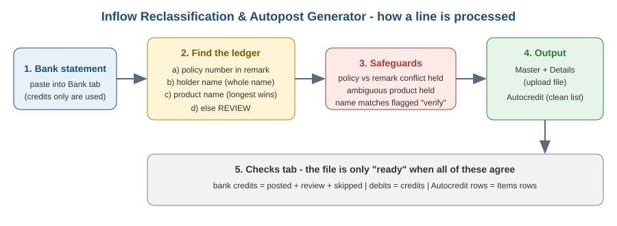

# Inflow Reclassification & Autopost Generator

An Excel-based tool that turns a **bank statement into a ready-to-upload accounting posting file**.
It reads each bank credit, works out which policy and product ledger it belongs to, builds the
Master/Details upload files, and proves the totals agree before anything is uploaded.

> Built from a real finance-operations process (daily bank inflow posting and reconciliation).
> **All data in this repository is fictional.** Names, policy numbers, ledger numbers and bank lines are made up.

## The problem

Each day a finance team receives a bank statement with hundreds of customer payments.
Every payment must be matched to a policy, classified to the correct product ledger, posted,
and reconciled. Done by hand this is slow, repetitive and error-prone, especially because bank
remarks come in several different layouts and customers often pay under slightly different names.

## What the tool does

- **Reads 5+ remark layouts** (underscore, hyphen, double-hyphen, "PAYTHRU" transfers, space-separated).
- **Policy number first.** Every 10-digit number in a remark is looked up in a policy database; the product on the policy decides the ledger.
- **Fallbacks, in a safe order:** holder name (whole-name match only), then the product written in the remark.
- **Longest-alias matching.** "Extra Family Plus" is never confused with "Family Plus".
- **Safeguards instead of guesses.** If the policy and the remark disagree, or two ledgers tie, the line is held for review.
- **Handles two posting cases automatically:** intercompany (bank and product in different entities) and direct posting.
- **Generates the upload files** (`Master` and `Details`) plus a clean `Autocredit` list (date, amount, holder, policy ID, remark, policy name).
- **Built-in controls** on the `Checks` tab: credits reconcile, debits equal credits, Autocredit equals Items.

## Quick start

1. Open `Inflow_Reclassification_Tool_DEMO.xlsx` in desktop Excel and click **Enable Editing**.
   Wait for "Calculating" to finish (the first calculation takes a few seconds).
2. Look at the **Checks** tab. The demo statement posts 29 lines, holds 2 for review, and skips 3.
3. Open **Classify** to see how each line was decided (Status, Basis and Note columns).
4. To use your own data:
   - paste your statement into **Bank** (columns A:G),
   - replace **Policy_Data** with your policy list (policy no., holder name, product),
   - edit **Ledgers** (ledger numbers, product aliases) and **Config** (entities, bank ledger, intercompany accounts).

## What the demo data shows

| Scenario | Where to look |
|---|---|
| Policy found in database, ledger from its product | most lines on **Classify** (Basis: *Policy no. (Policy_Data)*) |
| Policy not in database, product written in remark | Basis: *Product name in remark*, with a note to add the policy |
| Policy and remark product disagree | Status **REVIEW**, Basis starts *CONFLICT* |
| No policy number, holder name in remark | Basis: *Holder name match - verify* |
| Unknown policy and no product | Status **REVIEW** |
| Debits and own-account transfers | Status **SKIP** |
| Intercompany vs direct posting | change `Config!B3` from `10-1` to `20-1` and watch Master/Details change |

## Workbook map

| Sheet | Purpose |
|---|---|
| Guide | step-by-step instructions inside the workbook |
| Checks | totals, safeguards, and the row counts to copy |
| Bank | paste the bank statement here |
| Classify | decision for every line (Status / Basis / Note) |
| Items | posted lines in posting order |
| Autocredit | clean list of posted transactions |
| Master, Details | the upload files |
| Policy_Data / Policy_Map | policy database / manual overrides |
| Ledgers / Config | ledger numbers, aliases, entities, settings |

More detail: [`how-it-works.md`](how-it-works.md).

## Design notes

- **Formulas only, no macros** - nothing to enable, easy to audit.
- Written to work in **desktop Excel for Windows**; formulas use only long-established functions
  (`INDEX`, `MATCH`, `SEARCH`, `SUMPRODUCT`, `IFERROR`).
- Inputs are blue text on yellow cells; everything else is a formula.

## Limitations

- Capacity: 300 bank lines per run, 20 ledgers, 60 aliases, 16,020 policy records.
- Remark layouts are recognised by pattern; a new bank format may need an extra rule.
- Names split by the bank's line-wrapping (for example `IBRAH IM`) are shown as received.

## Roadmap ideas

- Power Query version for larger files
- Python/pandas port of the matching logic
- Automated tests for each remark layout

## Author

**Wasiu Agboola** - Financial Operations & Data Analyst
Portfolio: https://wasiuagboola1-glitch.github.io/Wasiu--Portfolio-/

## License

MIT - see [`LICENSE`](LICENSE).
